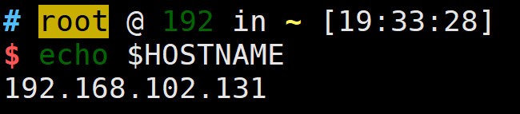
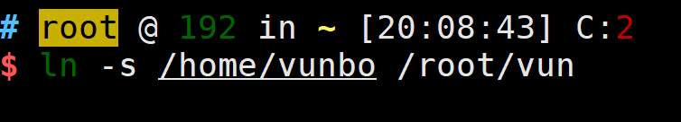
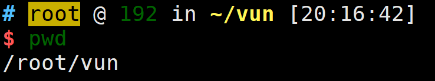
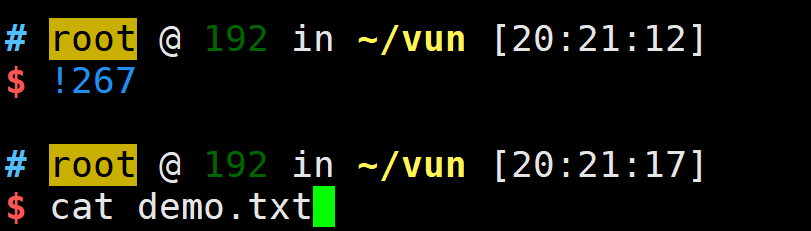
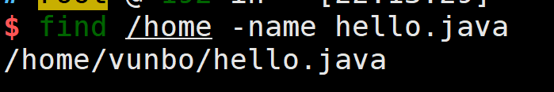
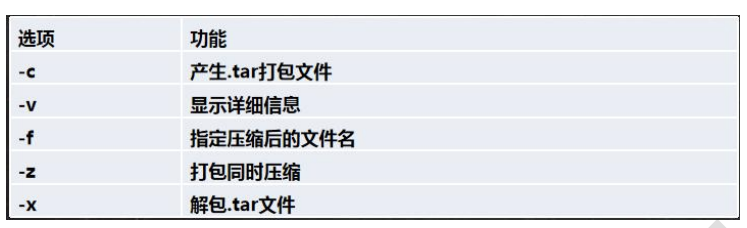

# Linux

在Linux世界里，一切皆文件

## 1.网络的三种方式

- 桥接模式：虚拟系统可以和外部系统通讯，但是容易造成IP冲突
- NAT模式：网络地址转换模式，虚拟系统和外部通讯，不造成IP冲突
  - **更换连接模式后，虚拟的IP地址会变更，导致远程的XSHELL无法连接**

- 主机模式：独立系统

## 2.Linux目录结构

- **`/bin 常用`** (/usr/bin，/usr/local/bin) 是 Binary 的缩写，这个目录存放着最**经常使用的命令**
- `/sbin` （/usr/sbin,  /usr/local/sbin) s 是 Super User的意思，这里存放的是系统管理使用的系统管理程序
- `/home 常用`  **存放普通用户的主目录**， 在 Linux 中每个用户都有一个自己的目录， 一般该目录名是以用户的账号命名
- `/root 常用`  该目录为**系统管理员**，也称作超级权限者的用户主目录
- `/lib` 系统开机所需要，最基本的**动态链接共享库**，其作用类似于 Windows 里的 DLL 文件。几乎所有的应用程序都需要用到这些共享库
- `/lost+found` 这个目录一般情况下是空的，当系统非法关机后，这里就存放了一些文件
- `/etc 常用` 所有的系统管理所需要的**配置文件**和子目录，比如安装 mysql 数据库 my.conf
- `/usr 常用`  这是一个非常重要的目录，**用户的很多应用程序和文件都放在这个目录下**，类似 windows 下的 program files 目录
- `/boot 常用` 存放的是**启动 Linux 时**使用的一些核心文件，包括一些连接文件以及镜像文件
- `/proc 不能动` 这个目录是一个虚拟的目录，它是系统内存的映射，访问这个目录来获取系统信息
- `/srv 不能动`  service缩写，该目录存放一些服务启动之后需要提取的数据
- `/sys 不能动` 这是 Linux 2.6 内核的一个很大的变化。该目录下安装了2.6内核中新出现的一个文件系统 sysfs
- `/tmp` 这个目录是用来存放一些**临时文件**的
- `/dev` 类似于 windows的**设备管理器**，把所有的硬件用文件的形式存储
- `/media 常用` linux 系统会自动识别一些设备，例如 U 盘、光驱等等，当识别后，**linux会把识别的设备挂载到这个目录下**
- `/mnt 常用` 系统提供该目录是为了让用户临时挂在别的文件系统的，我们可以将外部的存储挂载在 `/mnt`上，然后进入该目录就可以查看里边的内容.**共享**
- `/opt` 这是给**主机额外安装软件所存放的目录**。如安装ORACLE数据库就可以放到该目录下。默认为空
- `/usr/local 常用` 这是另一个给主机额外安装软件所安装的目录。**一般是通过编译源码方式安装的程序**
- `/var 常用` 这个目录中存放着不断扩充着的东西。习惯将经常被修改的目录放在这个目录里。包括**各种日志文件**
- `/selinux[security-enhanced linux]` SELinux 是一种安全子系统，它能控制程序只能访问特定文件，有三种工作模式，可以自行设置

## 3.IP查看

- `ifconfig`

  

## 4.开机与重启

- `shutdown -h now` 立刻进行关机 **h等同于`halt`**
- `shutdown -h 1` 表示1分钟后关机
- `shutdown -r now` 现在重新启动计算机
- `reboot` 现在重启计算机
- `sync` 把内存的数据同步到磁盘 **小心驶得万年船**(以上命令在关机前进行了sync)

## 5.登录与退出

- 尽量少用root账号登陆，系统管理员，避免操作

- `su - root` 切换到 `root` 管理员角色
- `logout 注销`，退出管理员角色。在运行级别3下有效，在图形界面级别无效。
- `su root` 临时切换，`exit` 退出`root` 管理员角色

## 6.用户管理

- 添加用户：`useradd 用户名`
  - 指定目录：`useradd -d 指定目录 新的用户名`

- 设置密码：`passwd 用户名`
- 删除用户(保留`home目录`)：`userdel 用户名`
- 删除用户(不保留)：`userdel -r 用户名`.**谨慎，慎重**
- 查询用户信息：`id 用户名`
- 切换用户：`su 用户名`
- 查看当前用户: `whoami`

### 6.1用户和组相关文件

- `/etc/passwd`文件
  - 用户的配置文件，记录用户的各种信息
  - 每行的含义： **用户名：口令：用户标识号：注释性描述：主目录：登录shell**
- `/etc/shadow`文件
  - 口令的配置文件
  - 每行的含义：**登录名：加密口令：最后一次修改时间：最小时间间隔：最大时间间隔：警告时间：不活动时间：失效时间：标志**
- `/etc/group`文件
  - 组的配置文件，记录linux包含的组的信息
  - 每行含义：**组名：口令：组标识号：组内用户列表**

## 6.2用户组

- 添加组：`groupadd 组名`
- 增加用户时直接加上组： `useradd -g 用户组 用户名`
- 修改用户的组：`usermod -g 用户组 用户名`
- 删除组：`groupdel 组名`

## 7.Vim编辑器

- `i` 进入**插入模式**

- `:` 从一般模式进入命令行模式

- `ESC`  返回**一般模式**

- `q [quit]` 退出

- `q!` 强制退出，不保存

- `w [write]` 保存

- `yy` 拷贝当前行，拷贝当前行向下的5行`5yy`，并执行粘贴`p` **一般模式下**

- `dd` 删除当前行，删除当前行向下的多行`5dd`

- `/关键字` **命令行模式** 回车查找， 输入`n`就是查找下一个，`N`查找上一个

- `:set  nu 和 :set nonu` **命令行模式下** **展示文件的行号**，取消文件的行号

- `G 和 gg` **一般模式下** 到文档的最末和最首行

- `u` **一般模式下**, 撤销操作

- `20 shfit + g` **一般模式下** 快速移动光标到第20行

  - `20 gg`

  

## 8.实用指令

### 8.0 查看信息指令

- `ll`显示列表, 等价于`ls -lh`

- `ls -al`，显示隐藏的文件

  - `-h`， 表示文件大小转换为带单位的方式显示

    

### 8.1运行级别

- 0：关机
- 1： 单用户（找回丢失密码）
- 2：多用户状态没有网络服务
- 3：多用户状态有网络服务 `multi-user.target`
- 4：系统未使用保留给用户
- 5：图形界面 `graphical.target`
- 6：系统重启

**常用运行级别是3和5，也可以指定默认运行级别**

### 8.2指定运行级别 

`init 0-6`

- 查看当前级别：`systemctl get-default`
- 设置当前的级别：`systemctl set-default TARGET.target`

### 8.3找回root密码

- 重启时，按`e`
- 找到`Linux16开头所在行数`, 在行的最后空格后输入`init=/bin/sh`
- 输入完成后，快捷键`ctrl+x`，进入单用户模式
- 在光标闪烁位置输入：`mount -o remount,rw /`(各个单词之间有空格), 然后回车
- 输入：`passwd`，回车后，输入密码，**然后再次确认密码即可**。密码修改成功，会显示 passwd...的样式，说明密码修改成功
- 输入：`touch / .autorelabel`（touch 与 / 后面有一个空格），回车
- 继续在光标闪烁位置输入：`exec /sbin/init`(exec与/有一个空格)，完成后回车，等待系统启动

### 8.4帮助指令

- man 获得帮助信息
  - 基本语法：`man [命令或配置文件]`
  - 案例：查看ls命令的帮助信息 `man ls`
  - 在Linux下，隐藏文件是以`.`开头，选项可以组合使用 如`ls -al`

- help 指令
  - 基本语法： `help 命令（获取shell内置命令的帮助信息）`

### 8.5文件目录

- `pwd`，显示当前所在的目录 `print working directory`，**绝对路径**
- `ls`
  - `ls -a`，显示当前目录所有的文件和目录，包括隐藏的
  - `ls -l`， 以列表的方式显示信息
    - root: `cd ~ 到 /root`
    - tom: `cd ~ 到 /home/tom`
  
- `cd`
  - `cd ~` 回到自己的家目录
  - `cd ..` 回到当前目录的上一级目录

### 8.6文件目录类

- `mkdir指令`，用于创建目录
  - `mkdir [选项] 要创建的目录`
  - 常用选项`-p` 创建多级目录 `mkdir -p /home/animal/dog`
- `rmdir指令`, 删除空目录
  - `rmdir [选项] 要删除的空目录`
  - 如果要删除目录下有内容，需要使用**`rm -rf 目录`(慎重使用)**
- `touch指令`,创建一个空文件
  - `touch 文件名称`
- `cp 指令`，拷贝指定文件到指定目录
  - `cp [选项] source dest`
  - 常用选项`-r`，递归复制整个文件夹
  - 若文件已存在，强制覆盖(不用提示)：`\cp -r /home/bbb /opt`
- `rm 指令`, 移除文件或目录
  - `rm [选项] 要删除的文件或目录`
  - `-r`， 递归删除整个文件夹
  - `-f`， 强制删除不提示
- `mv 指令`, 移动文件与目录或重命名
  - `mv oldFileName newFileName` （同目录下，则是重命名）
  - `mv /home/hello.txt /opt/hello.txt`（不同目录下，则是移动)
- `cat 指令` 查看文件内容
  - `cat [选项] 要查看的文件`
  - `-n`  显示行号
  - **cat 只能浏览文件，不能修改文件，为了浏览方便，一般会带上 管道命令 | more**
- `more 指令`
  - 一个基于VI编辑器的文本过滤器，以全屏幕的方式按页显示文本文件的内容，more 指令中内置了若干块快捷键（交互的指令）
  - 基本语法：`more 要查看的文件`
  - `空格键space`，向下翻一页
  - `Enter`，向下翻一行
  - `q` 代表立即离开 more，不再显示该文件内容
  - `ctrl + F`，向下滚动一屏
  - `ctrl + B`，返回上一屏
  - `=`， 输出当前行的行号
  - `:f`,  输出文件名和当前行的行号
- `less`指令
  - 分屏查看文件的内容，功能与 more 指令类似，但是比 more 指令更加强大，支持各种显示终端。less 指令在显示文件内容时，并不是一次将整个文件加载之后显示，而是根据显示需要加载内容，对于显示大型文件具有较高的效率
  - 基本语法：**`less 要查看的文件`**
  - 
- `echo`指令
  - 输出内容到控制台
  - 基本语法：`echo [选项] [输出内容]`
  - 

- `head`指令

  - 用于显示文件的开头部分内容，默认情况下，head 指令显示文件的前10行内容
  - 基本语法：`head 文件`,（表示查看文件的前10行内容）
  - `head -n 5 install.sh`， 表示查看文件的头5行内容

- `tail`指令

  - 用于输出文件中尾部的内容，默认情况下 tail 指令显示文件的尾10行内容
  - `tail -n 5 文件`, 查看文件的尾5行内容
  - `tail -f 文件`，实时跟踪该文档的所有更新(需要用到追加指令`>`)

- `>`指令和`>>`指令

  - `>` 将内容写入到其他文件中
  - `>>`将内容追加到其他文件中
  - `ls -l > 文件foo`（功能描述：列表的内容写入文件foo中(覆盖)）
  - `ls -al >> 文件bar`（功能描述：列表的内容追加到文件bar的末尾）
  - `echo "内容" >> 文件` 将打印的内容写入到文件中

- `ln 指令`

  - `ln -s [源文件或目录] [软链接名]` (给源文件创建一个软连接)

  - `ln -s /home/vunbo /root/vun` ：在root下创建一个/home/vunbo的软连接vun
  - 
  - 删除软连接：`rm /root/vun`
  - 说明：当使用 `pwd` 指令查看目录时，仍然看到的是软连接所在的目录
  - 

- `history 指令`
  - 查看已经执行过的历史命令，也可以执行历史指令
  - `history`: 查看已经执行过的历史命令
  - `history 10`：显示最近使用过的10个指令
  - `!292`：执行历史编号为292的指令（自动输出指令，需要主动执行）
  - 

### 8.7时间日期类

- `date`指令，显示当前日期

  - `date`，显示当前时间
  - `date "+%Y"`，显示当前年份
  - `date "+%m"`，显示当前月份
  - `date "+%d"`，显示当前是哪一天
  - `date "+%Y-%m-%d %H:%M:%S"`，显示年月日时分秒

  - **设置系统当前时间**：`date -s "2020-10-10 10:10:00"`, 重启恢复

- `cal`日历指令
  - `cal` 查看日历
  - 基本语法：`cal [options]`（不加选项，显示本月的日历）
  - `cal 2022`，显示2022年12个月的日历

### 8.8搜索查找类

- `find`指令
  - 从指定目录向下递归地遍历各个子目录，将满足条件的文件或目录显示在终端
  - 基本语法：`find [搜索范围] [选项]`
  - `-name <查询方式>` 按照指定的文件名查找模式查找文件
    - 
  - `-user <用户名>` 查找属于指定用户名所有文件
    - `find /opt -user vunbo`
  - `-size <文件大小>` 按照指定的文件大小查找文件（+n 大于，-n小于，n等于，单位有 k，M，G）
    - `find / -size +200M`

- `locate`指令
  - 快速定位文件路径。利用事先建立的系统中所有文件名称及路径的 locate 数据库实现快速定位给定的文件。
  - 基本语法：`locate 搜索文件`
  - 特别说明：由于`locate`指令基于数据库进行查询，所以第一次运行前，必须使用`updatedb`指令创建 locate 数据库
  - **which 指令，可以查看某个指令在哪个目录下**

- `grep 指令和管道符号|`
  - grep 过滤查找，管道符"|"，表示将前一个命令的处理结果输出传递给后面的命令处理
  - 基本语法：`grep [options] 查找内容 源文件`
  - `-n`，显示匹配行及行号
  - `-i`， 忽略字母大小写
  - `grep -n 'l' demo.txt`，在demo.txt中查询“l”这个字符，并显示行号
  - 写法2：`cat demo.txt | grep 'l'`

### 8.9压缩和解压类

- `gzip/gunzip`指令
  - `gzip`用于压缩文件，`gunzip`用于解压
  - 基本语法：`gzip 文件`（将文件压缩为`*.gz`文件）
  - `gunzip 文件.gz`：解压文件
- `zip/unzip指令`
  - `zip`压缩文件和目录的指令，`unzip`解压文件
  - `zip [选项] xxx.zip`，压缩内容
    - `-r`: 递归压缩，即压缩目录
  - `unzip [选项] xxx.zip`，解压文件
    - `-d<目录>`：指定解压后文件的存放目录
  - `zip -r demo.zip /home/vunbo`: 将/home/vunbo下文件打包成demo.zip
  - `unzip -d /root/ demo.zip`: 将demo.zip文件，解压到/root/下
- `tar指令`
  - 打包指令，常用于将多个文件打包成一个文件.tar.gz
  - 基本语法：`tar [options] xxx.tar.gz 打包的内容`，打包目录，压缩后的文件格式`.tar.gz`
  - 
  - 压缩文件：`tar -zcvf pc.tar.gz /home/vunbo /home/milan`：将多个文件压缩成 `pc.tar.gz`
  - 解压文件：`tar -zxvf pc.tar.gz`，解压到当前目录
  - 将pc.tar.gz解压到/opt/tmp2目录下：
    1. `mkdir /opt/tmp2`
    2. `tar -zxvf /root/pc.tar.gz -C /opt/tmp2`

